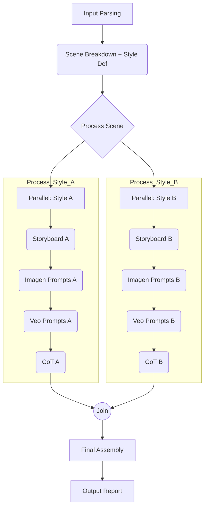

# System Patterns: AI Film Director Agent

## 1. Core Architecture: ADK Orchestration

The agent is built using the Google Agent Development Kit (ADK) as the central orchestrator. ADK manages the overall workflow, state, and interactions with external AI services.

## 2. Workflow Pattern (Current - Text Prompt Generation)

The current active implementation uses a **Granular Sequential Workflow** pattern via ADK's `SequentialAgent` (`AI_Film_Director_Text_Prompts` in `agent.py`) to orchestrate 5 core text generation steps. This approach focuses on producing a detailed planning document with prompts ready for external use.

The 5 core steps are:
1.  **Analyze & Breakdown (`agent_analyze_and_breakdown`):** An `LlmAgent` analyzes user input and generates the Scene Breakdown text using `ANALYZE_AND_BREAKDOWN_PROMPT`, saving it to `state['scene_breakdown']`. Uses `COMPLEX_MODEL_NAME`.
2.  **Generate Storyboard (`agent_generate_storyboard`):** An `LlmAgent` reads `state['scene_breakdown']` and generates the Storyboard Overview text using `GENERATE_STORYBOARD_PROMPT`, saving it to `state['storyboard_output']`. Uses `COMPLEX_MODEL_NAME`.
3.  **Generate Imagen Text Prompts (`agent_generate_imagen_text_prompts`):** An `LlmAgent` reads `state['storyboard_output']` and generates Imagen text prompts using `GENERATE_IMAGEN_TEXT_PROMPTS_PROMPT`, saving it to `state['imagen_text_prompts_output']`. Uses `COMPLEX_MODEL_NAME`.
4.  **Generate Veo Text Prompts (`agent_generate_veo_text_prompts`):** An `LlmAgent` reads `state['storyboard_output']` and generates Veo text prompts using `GENERATE_VEO_TEXT_PROMPTS_PROMPT`, saving it to `state['veo_text_prompts_output']`. Uses `COMPLEX_MODEL_NAME`.
5.  **Assemble Report (`agent_assemble_report`):** An `LlmAgent` reads `state['scene_breakdown']`, `state['storyboard_output']`, `state['imagen_text_prompts_output']`, and `state['veo_text_prompts_output']` and uses `ASSEMBLE_REPORT_PROMPT` to generate the final comprehensive text-only report. Uses `COMPLEX_MODEL_NAME`.

This flow uses distinct `LlmAgent`s for each generation task and relies on `output_key` for state transfer. It does **not** involve any external API tool calls for image or video generation.

## 3. Workflow Pattern (Future Considerations)

If direct API access becomes feasible and desired, the workflow could be extended to include steps for parsing prompts and calling tools like `ImagenTool` or `VeoTool`. This might re-introduce parsing/extraction steps and potentially parallel processing for efficiency. The original 8-step plan (including tool calls) serves as a reference for such future enhancements.

## 4. Workflow Pattern (Original Target Architecture - Post-MVP)

The target architecture aims to handle stylistic variations more efficiently using a **Parallel Workflow** pattern within the main sequence:

*   An ADK `ParallelAgent` could manage the concurrent processing of "Style A" and "Style B" for each scene.
*   Each parallel branch (`Process_Style_A`, `Process_Style_B`) would likely be a `SequentialAgent` containing the text generation steps: Storyboard Gen -> Imagen Prompt Gen -> Veo Prompt Gen. (CoT Gen is currently omitted). If API tools were added later, they would follow these text generation steps.

## 5. State Management Pattern

*   **ADK State Object:** The primary mechanism for passing data between workflow steps and managing context.
*   **Structure:** Data is stored with keys indicating the scene and style where applicable (e.g., `state['scene_1']['style_A']['storyboard']`).
*   **Data Flow:** Each step reads necessary context from the state (e.g., storyboard generation reads the scene breakdown) and writes its output back to the state (e.g., `output_key` parameter in `LlmAgent`).

## 6. Tool Abstraction Pattern (Current: Text-Only)

*   The current workflow **does not use any external API tools** (`FunctionTool`s) defined in `tools.py`. The `director_tools` list in `tools.py` is empty.
*   All core generation steps (Breakdown, Storyboard, Imagen Prompts, Veo Prompts, Report Assembly) are handled directly by ADK `LlmAgent`s within the `SequentialAgent` workflow (`agent.py`).
*   These `LlmAgent`s use specific prompt templates defined in `prompts.py` and interact with the Gemini API (`google-generativeai`) via the ADK framework's built-in capabilities for text generation.
*   Previous iterations involved tools like `imagen_tool`, `prompt_parser_tool`, `extract_tasks_tool`, but these have been removed to focus on text prompt generation only.

## 7. Shot Segmentation Pattern (Veo 2 Prompts)

*   Due to potential duration limits in video generation tools like Veo 2, handling longer conceptual shots requires a specific pattern within the prompt generation step.
*   **Current Approach:**
    1.  **LLM Prompting:** The `GENERATE_VEO_TEXT_PROMPTS_PROMPT` used by the `agent_generate_veo_text_prompts` step instructs the LLM to analyze storyboard shot descriptions. If a shot's action seems likely to exceed a typical short clip duration (e.g., 8 seconds), the LLM is instructed to generate multiple sequential Veo text prompts for that single conceptual shot, including continuity notes between segments.
    2.  **State Storage:** The generated text containing potentially segmented Veo prompts is stored in `state['veo_text_prompts_output']`.
    3.  **Output Representation:** The final report (assembled by `agent_assemble_report`) presents these potentially segmented prompts clearly under the corresponding conceptual shot, ready for the user to execute externally. No tool execution occurs within the agent.
